# Minecraft Gray Wave Machines Add-on

This sample demonstrates the Gray Wave Machines tower-defense style add-on for Minecraft.

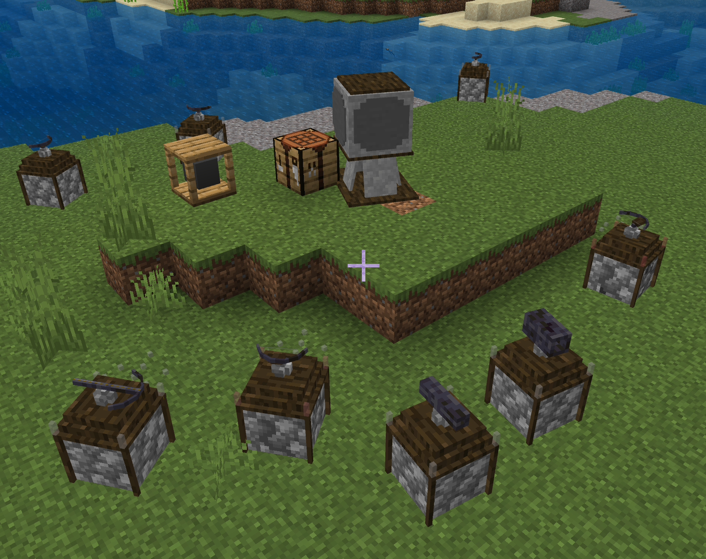

The Gray Wave add-on supports a basic concept of automated defense systems and turrets and Minecraft.

## New Mineral

First, there is gray ore spread throughout the world. It should largely be as prevalent as coal. Gray ore, due to its gray energy, is slightly luminescent.

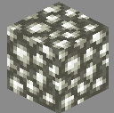

## Gray Wave Machines

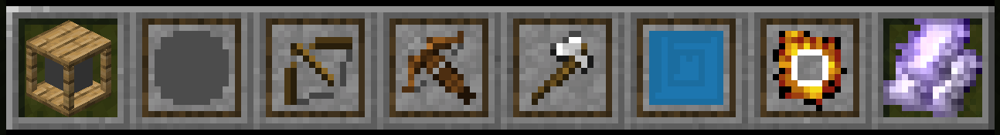

### Fabricator Block

If you mine gray ore, then with the following recipe you can create a gray wave fabricator. With the gray wave fabricator, you can then build some machines!

|       |          |       |
| ----- | -------- | ----- |
| stick | gray ore | stick |
| stone | gray ore | stone |
| stick | gray ore | stick |

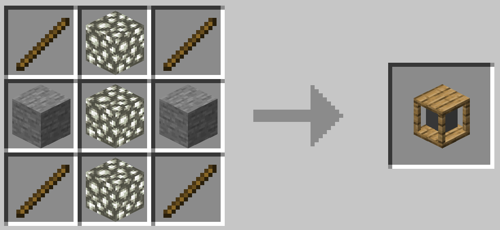

The fabricator works like a crafting table. Inside of the fabricator, you can craft gray wave generators and other machines.

Keep in mind all gray wave generators must have line of sight visibility (i.e., only air blocks between the item and a generator), within a range of 30 blocks. Gray wave generators are also fairly fragile, so ensure they are secured from monsters!

Gray wave turrets and cannons have subtle, slightly transparent indicators at their corners that indicate if they are powered by a nearby gray wave generator. They will turn pink to red if the turret gets damaged.

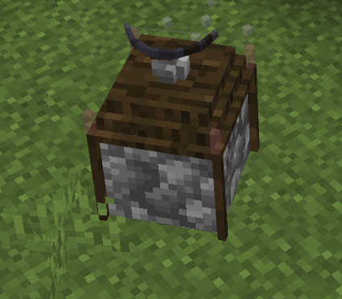

### Gray Wave Generators

These generators create the mostly-invisible gray waves that are used to power gray wave machines.

|       |          |       |
| ----- | -------- | ----- |
| stone | gray ore | stone |
| stone | sand     | stone |
| stone | gray ore | stone |

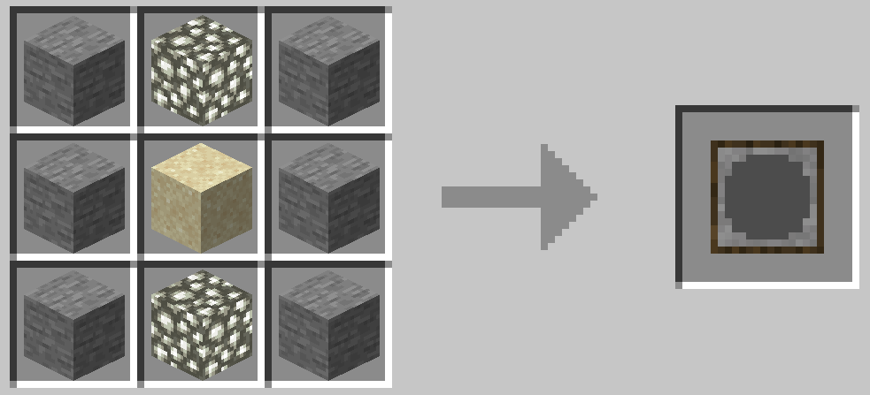

### Bow Turret

This is the simplest turret. It has a slow and weak (but long range) arrow shot. It can be built in the fabricator using:

|       |          |       |
| ----- | -------- | ----- |
|       | gray ore |       |
| stone | bow      | stone |
| stone | gray ore | stone |

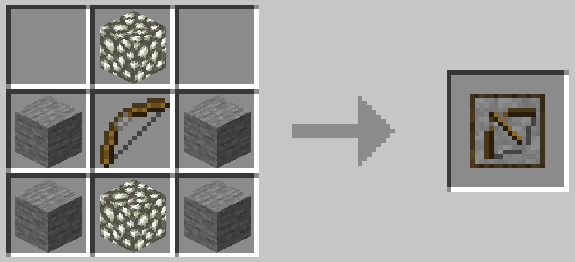

### Crossbow Turret

This is an evolution of the bow turret. Compared to the bow turret, it has a much faster and more powerful shot - with slightly less range. It can be built in the fabricator using:

|       |          |       |
| ----- | -------- | ----- |
|       | gray ore |       |
| stone | crossbow | stone |
| stone | gray ore | stone |

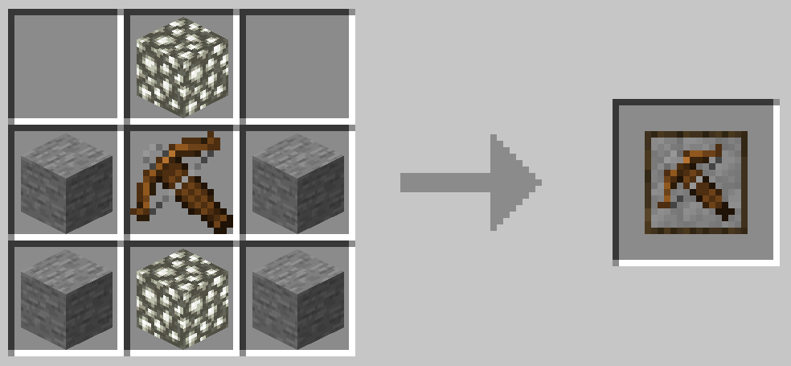

### Axe Turret

The axe turret is a melee turret, for close-in defense.

|       |            |       |
| ----- | ---------- | ----- |
|       | gray ore   |       |
| stone | iron ingot | stone |
| stone | gray ore   | stone |

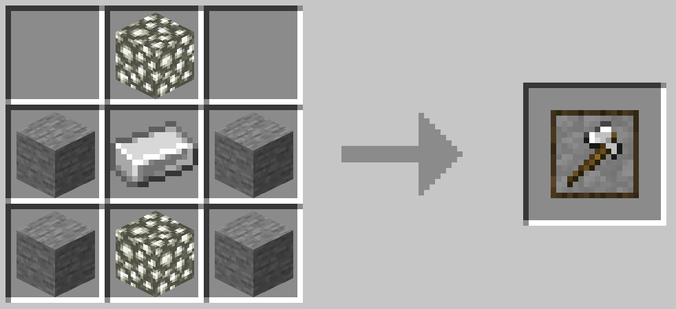

### Shulker Cannon

The shulker cannon shoots out shulker bullets, which can harm and cause a target to levitate.

|       |          |       |
| ----- | -------- | ----- |
|       | gray ore |       |
| stone | bamboo   | stone |
| stone | gray ore | stone |


### Small Fireball Cannon

The small fireball cannon shoots out small fireballs, at a bit of a closer range.

|       |          |       |
| ----- | -------- | ----- |
|       | gray ore |       |
| stone | charcoal | stone |
| stone | gray ore | stone |

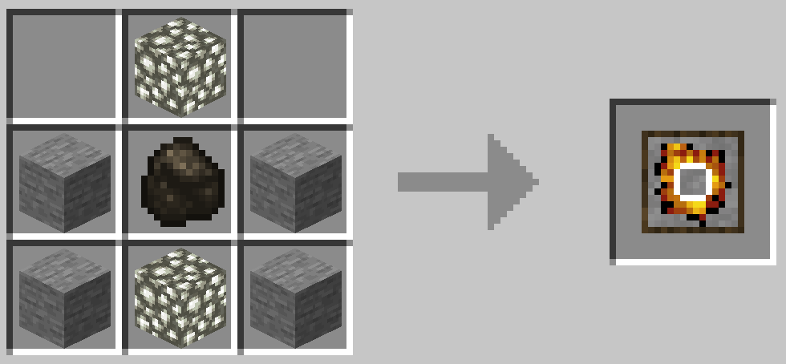

## Gray Hordes

Graywave generators attract hordes of evil mobs, so be prepared! These hordes of mobs are led by the "gray leader", an evolution of zombies with receptors for detecting gray waves.

On the positive side, gray zombie leaders will drop depleted gray shards, which can be placed in the fabricator along with wheat seeds to create emeralds. So, you can earn a lot by building awesome defense that can handle hordes.

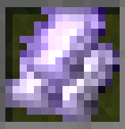

|                     |                     |                     |
| ------------------- | ------------------- | ------------------- |
| depleted gray shard | depleted gray shard | depleted gray shard |
| depleted gray shard | wheat seeds         | depleted gray shard |
| depleted gray shard | depleted gray shard | depleted gray shard |

## Prerequisites

### Install Node.js tools, if you haven't already

We're going to use the Node Package Manager (or NPM) to get more tools to make the process of building our project easier.

Visit [https://nodejs.org/](https://nodejs.org).

Download the version with "LTS" next to the number and install it.

### Install Visual Studio Code, if you haven't already

Visit the [Visual Studio Code website](https://code.visualstudio.com) and install Visual Studio Code.

## Getting Started

1. Using a copy of this starter project from GitHub - you can get a copy of this project by visiting [https://github.com/microsoft/minecraft-samples/](https://github.com/microsoft/minecraft-samples/) and, under the Code button, selecting `Download ZIP`.

1. The `casual_creator/chill_dreams` folder contains different stages of the chill dreams project for Minecraft. Use the subfolder of the phase you want to start with.

1. To make your own environment look like the example, create a folder on your `C:\` drive and call it **projects**. Create a subfolder called **myaddon**.

1. Put the extracted contents of the Add-on Starter Project folder into **myaddon**.

1. Open a Windows Terminal or PowerShell window and change the working directory to your **myaddon** folder:

   ```powershell
   cd c:\projects\myaddon\
   ```

1. Use NPM to install our tools:

   ```powershell
   npm i
   ```

1. Use this shortcut command to open the project in Visual Studio Code:

   ```powershell
   code .
   ```

It might also ask you to install the Minecraft Debugger and Blockception's Visual Studio Code plugin, which are plugins to Visual Studio Code that can help with Minecraft development. Go ahead and do that, if you haven't already.

### Summary

Chill Dreams demonstrates several techniques for building a thematic Add-On in Minecraft. Please view the series on [the Minecraft Creator Learning Portal](https://learn.microsoft.com/minecraft/creator/casual) for more info.

## Manifest

-[1_dream_turkey](https://github.com/microsoft/minecraft-samples/blob/main/casual_creator/chill_dreams/1_dream_turkey/): This contains project files that correspond to [part 1 of the blog series](https://learn.microsoft.com/minecraft/creator/casual/chilldreamspart1thedreamturkey) -[2_dreams_come_true](https://github.com/microsoft/minecraft-samples/blob/main/casual_creator/chill_dreams/2_dreams_come_true/): This contains project files that correspond to [part 2 of the blog series](https://learn.microsoft.com/minecraft/creator/casual/chilldreamspart2makingdreamscometrue) -[complete](https://github.com/microsoft/minecraft-samples/blob/main/casual_creator/chill_dreams/complete/): This contains project files that correspond to [part 3 of the blog series](https://learn.microsoft.com/en-us/minecraft/creator/casual/chilldreamspart3smellslikememories)
